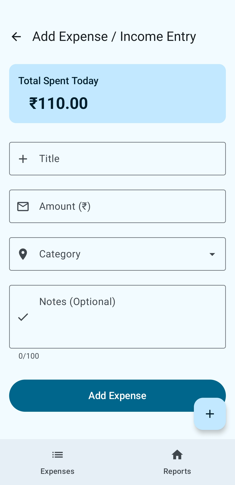
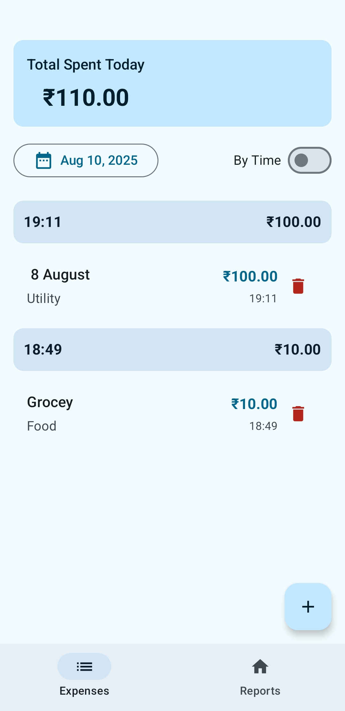
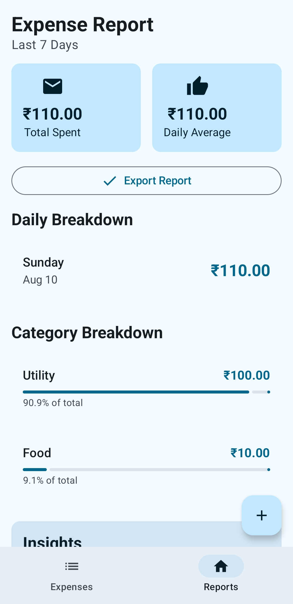

# Smart Daily Expense Tracker 📊💸

A **full-featured Expense Tracker module** built with **Jetpack Compose** following **MVVM architecture**, designed to help **small business owners** digitize and analyze their daily expenses effortlessly.

This module bridges the gap of unrecorded or lost expenses (often on WhatsApp or paper) by providing an intuitive, intelligent, and offline-friendly way to **capture, view, analyze, and export expense data**.

---

## ✨ Features

### 1. Expense Entry Screen

* Add new expense with:

  * **Title** (text)
  * **Amount (₹)** (validated: > 0)
  * **Category** (Staff, Travel, Food, Utility – mocked list)
  * **Notes** (optional, max 100 chars)
  * **Receipt Image** (upload/mock)
* Real-time **“Total Spent Today”** shown at the top
* **Animations** + Toast on successful entry
* **Duplicate detection** (bonus)

### 2. Expense List Screen

* View expenses:

  * **Today (default)**
  * **Previous dates** (calendar/filter)
* Group expenses by:

  * **Category**
  * **Time** (toggle)
* Shows:

  * **Total count**
  * **Total amount**
  * **Empty state UI**

### 3. Expense Report Screen

* **7-day mock report** with:

  * Daily totals
  * Category-wise totals
  * Bar/Line chart (mocked with Compose UI)
* **Export options**:

  * Simulated **PDF/CSV export**
  * Trigger **Share intent**

---

## 🛠️ Architecture & Tech Stack

* **UI Layer:** Jetpack Compose (Material 3, animations)
* **Architecture:** MVVM (Model-View-ViewModel)
* **State Management:** StateFlow 
* **Navigation:** Jetpack Navigation (multi-screen flow)
* **Data Layer:**
* 
  * Room / DataStore 
* **Charts:** Mocked Compose visualizations
* **Theme:** Light/Dark mode support

---

## 🚀 Bonus Features Implemented

* ✅ Theme switcher (Light/Dark mode)
* ✅ Local persistence (Room/Datastore)
* ✅ Entry animations
* ✅ Duplicate detection
* ✅ Input validation (amount > 0, title non-empty)
* ✅ Offline-first mock sync
* ✅ Reusable UI components

---

## 📂 Project Structure

```
com.smart.expensetracker
│
|── components         # Components / Widgets Required
├── data/              # Room/Datastore
├── di/                # Dependency Injection Using Dagger-Hilt
├── model/             # Expense models
├── repository/        # Repositrory for App
├── ui/                # Compose UI screens
│   ├── screens/
├── viewmodel/         # ViewModel for  screen
├── util/              # Some utils functions
└── navigation/        # Navigation graph
```

---

## 📸 Screenshots (Mock)

1. **Expense Entry Screen** – 
2. **Daily Expense List Screen** – 
3. **Expense Report Screen** – 

---

## 🔧 Setup & Installation

1. Clone the repo:

   ```bash
   git clone https://github.com/Dark-Coders995/Daily_Expense.git
   cd smart-expense-tracker
   ```
2. Open in **Android Studio (Arctic Fox or newer)**
3. Build & Run on emulator/device

---

## 📤 Export & Share

* Mock **PDF/CSV export (In Progress )**

---

## 🤖 AI Assistance in Development

AI tools were leveraged to:

* Generate boilerplate Compose UI components
* Create mock chart data and sample exports
* Draft project documentation (this README ✅)

---

## 🏗️ Future Improvements

* Real backend sync (Firebase/REST API)
* OCR for automatic receipt scanning
* Advanced analytics (monthly trends, forecasting)
* Multi-user/team expense tracking

---

## 📜 License

MIT License © 2025 Ayush Gupta
